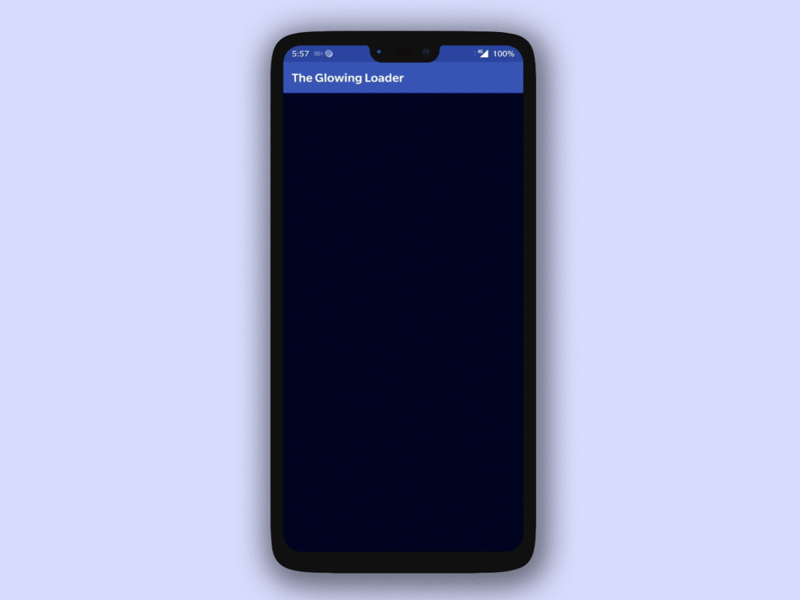
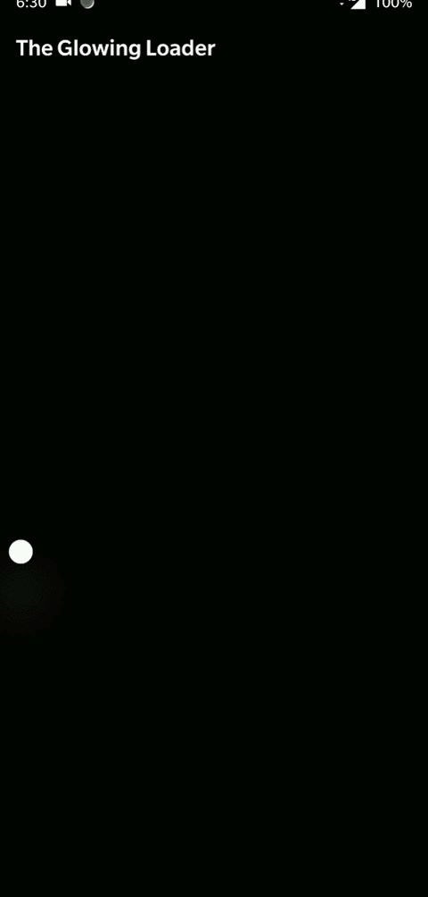

[](https://www.android.com)
[](https://android-arsenal.com/api?level=14)
[](https://www.apache.org/licenses/LICENSE-2.0.html)
[](https://jitpack.io/#varunest/TheGlowingLoader)


# TheGlowingLoader
Android Library which is the implementation of [The Glowing Loader](https://www.uplabs.com/posts/loader-fe7378f9-894d-4e6e-8340-968f41da9fa8) created by [Shashank Sahay](https://www.uplabs.com/shashanksahay). 

I have made it so that it can be easily customized. You can change line stroke width, line colors, particle colors, disable several effects etc. 

Library supports OS on API 14 and above.

**[Download Demo Apk](demo/app-debug.apk)**

**[Demo Video](https://www.youtube.com/watch?v=lSBTyfGWYAU)**

#### Here is how the loader looks by default:


#### But you can also tweak it according to your need:
| Example A                               | Example B|
| -------------                           | -------------                       |
|   |   |

## Dependency

Add it in your root build.gradle at the end of repositories:

```groovy
allprojects {
		repositories {
			...
			maven { url 'https://jitpack.io' }
		}
	}
```

and then add dependency

```groovy
dependencies {
	        implementation 'com.github.varunest:TheGlowingLoader:1.0.7'
	}
```

## Usage

```xml
<com.varunest.loader.TheGlowingLoader
        android:layout_width="match_parent"
        android:layout_height="match_parent"
        app:layout_constraintBottom_toBottomOf="parent"
        app:layout_constraintLeft_toLeftOf="parent"
        app:layout_constraintRight_toRightOf="parent"
        app:layout_constraintTop_toTopOf="parent" />
```

### Attributes

```xml
<attr name="theglowingloader_line_1_color" format="reference" />
        <attr name="theglowingloader_line_2_color" format="reference" />
        <attr name="theglowingloader_line_stroke_width" format="integer" />
        <attr name="theglowingloader_ripple_color" format="reference" />
        <attr name="theglowingloader_particle_1_color" format="reference" />
        <attr name="theglowingloader_particle_2_color" format="reference" />
        <attr name="theglowingloader_particle_3_color" format="reference" />
        <attr name="theglowingloader_disable_shadows" format="boolean" />
        <attr name="theglowingloader_disable_ripple" format="boolean" />
	<attr name="theglowingloader_shadow_opacity" format="float" />
```

You can also access and modify all these attributes at runtime by getting the reference of `TheGlowingLoader` and calling its `setConfiguration` method.

## Inspiration
This library was a result of challenge hosted by [Uplabs](https://www.uplabs.com/)

## Contribution
Any contributions, large or small,features, bug fixes are welcomed and appreciated. Use pull requests, they will be thoroughly reviewed and discussed.

## License
Library falls under [Apache 2.0](LICENSE.md)
